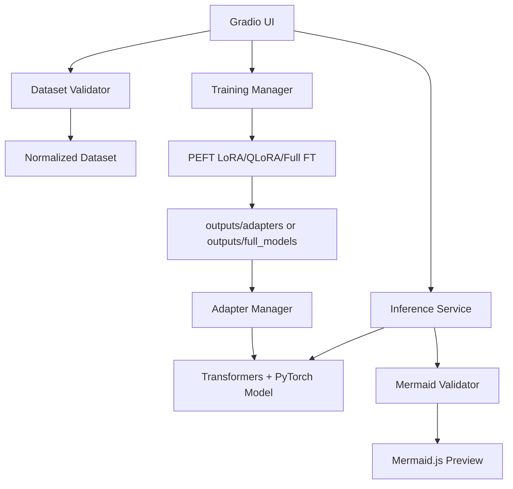

# System Architecture

## Runtime

The default model is `TinyLlama/TinyLlama-1.1B-Chat-v1.0`. Inference and training use Transformers and PyTorch. PEFT powers LoRA/QLoRA. bitsandbytes is optional for QLoRA and depends on CUDA compatibility.

## Launch Modes

The same Gradio app supports local and Colab/public launch paths:

- Local laptop: `python app.py --local`, defaulting to `http://127.0.0.1:7860` with `share=False`.
- Custom local bind: `python app.py --local --host 127.0.0.1 --port 7861`.
- Public share: `python app.py --share`.
- Colab: `python app.py --colab` or notebook launch with `share=True`.

Local mode does not require Gradio Live. Colab mode keeps Gradio sharing available because Colab localhost is not directly accessible from the user's browser.

## UI Layer

The UI remains Gradio Blocks and keeps two primary tabs:

- **Generator Mermaid**
- **Dataset & Fine-Tuning**

The visual theme uses a dark black/navy base with orange primary actions. The preview renderer remains the iframe-based Mermaid.js renderer so generated Mind Map and Venn diagrams display as SVG instead of plain text.

## Storage

Training outputs are written to `outputs/`, which is gitignored except for `.gitkeep`.
