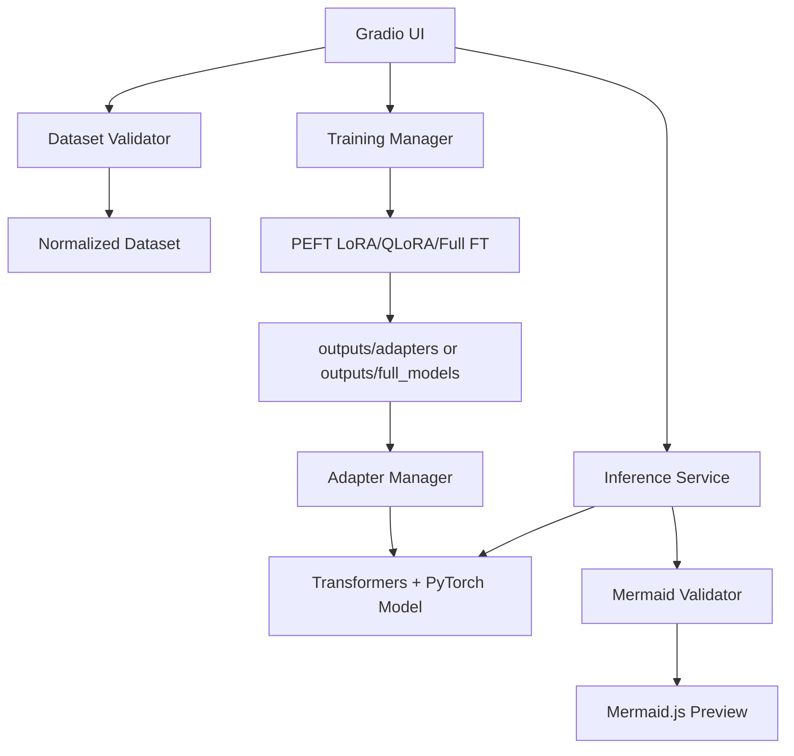

# System Architecture

## Runtime

The default model is `TinyLlama/TinyLlama-1.1B-Chat-v1.0`. Inference and training use Transformers and PyTorch. PEFT powers LoRA/QLoRA. bitsandbytes is optional for QLoRA and depends on CUDA compatibility.

## Storage

Training outputs are written to `outputs/`, which is gitignored except for `.gitkeep`.
