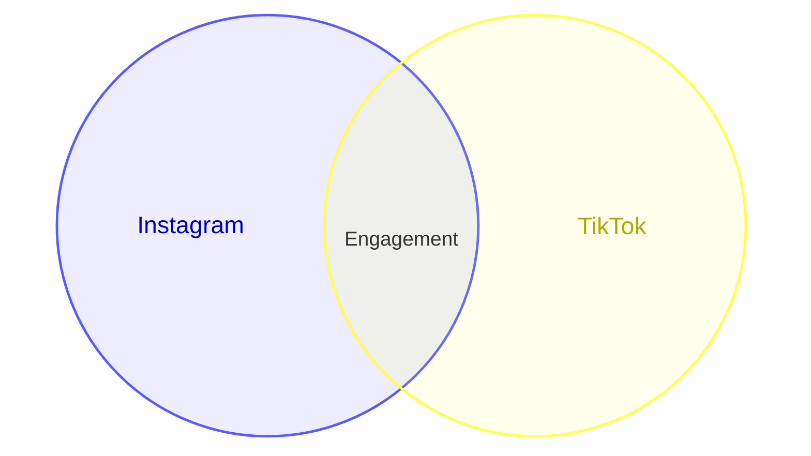

# Generation Failure Analysis

Analysis date: 2026-07-22 Asia/Jakarta

## User Evidence Summary

Manual Colab/Gradio testing showed that the training pipeline works:

- Gradio app launches.
- Dataset upload works.
- Curated dataset validation works: 150 total, 150 valid, 0 invalid, 0 warnings, 0 duplicates.
- LoRA training completed.
- Adapter ZIP was generated at `/content/MermaidGenerate/outputs/adapters/lora-20260721-181045.zip`.
- Active adapter status updated.
- Training loss was approximately `0.775`.
- Eval loss was approximately `0.450`.

The remaining critical failure is generation/rendering:

- Generated Mermaid code is not reliably valid.
- Venn preview fails.
- Raw model output can include irrelevant class/UML/manual integration text.
- Output does not stop cleanly after a single diagram.
- Renderer/validator error included: `Venn union references undefined set(s): Live Shows`.

## Root Cause

### 1. Small LoRA Smoke Training Does Not Guarantee Syntax Reliability

The LoRA run proves that fine-tuning infrastructure works, but a small smoke dataset and short training run do not guarantee perfect structured-code generation. The model can still copy unrelated patterns, echo prompt/template fragments, or continue into non-Mermaid content.

### 2. Prompt Template Was Too Weak

The previous prompt asked for Mermaid code only, but did not include strict positive/negative examples, stop instructions, or explicit Venn syntax constraints. This allowed the model to output class diagrams, UML fragments, explanation text, or multiple diagram fragments.

### 3. Missing Stop/Extraction Guard

The previous post-processing selected text from the first `mindmap` or `venn` prefix but did not robustly stop at:

- second diagram type
- repeated prompt/template text
- `Diagram type:`
- `User request:`
- `Rules:`
- `Output format:`
- `classDiagram`
- UML/class/flowchart contamination
- markdown fences

Invalid trailing text could reach validation and preview.

### 4. Venn Dataset and Renderer Syntax Were Misaligned

Earlier datasets used compact Venn labels such as:

```mermaid
venn
  set A["Instagram"]
  set B["TikTok"]
  union A,B["Engagement"]
```

The renderer-facing Mermaid Venn syntax is safer as:



Assignment-facing output may start with `venn`, but preview must explicitly convert the first line to `venn-beta`.

### 5. Validator Was Too Permissive and Not Syntax-Aligned

The validator accepted union lines with bracket labels and did not require union text child lines. It also had limited checks for contamination after the diagram. This made dataset validation pass but did not fully protect renderer syntax.

### 6. Deterministic Fallback Is Needed

For a demo-quality assignment app, invalid raw model output must not be passed directly to the renderer. The runtime needs a deterministic compiler fallback:

- If Venn raw output is invalid, extract set labels from the prompt/raw text and build a valid safe Venn.
- If Mind Map raw output is invalid, extract a topic from the prompt and build a valid safe mind map.

This does not fake model quality. It guarantees that the UI renders valid Mermaid while the raw model output remains available for debugging.

## Repair Strategy

The fix adds a guarded generation pipeline:

```text
raw model output
  -> extract_first_mermaid_diagram
  -> repair_or_compile_venn / repair_or_compile_mindmap
  -> validate_mermaid_code
  -> convert Venn to renderer-facing venn-beta
  -> render preview
```

## Success Criterion

The app is fixed only when:

- Mind Map prompt produces valid final code and renders.
- Venn prompt produces valid final code and renders.
- Undefined Venn union references are repaired.
- Invalid raw model output is not displayed as the main code.
- Main code textbox contains final valid Mermaid code.
- Fallback status is visible to the user.

## Manual Retest Finding: Valid Code But No SVG Render

Additional manual Colab/Gradio screenshots from 2026-07-22 showed an improved but still incomplete state:

- The active adapter was loaded from `outputs/adapters/lora-20260722-040755`.
- The dataset still validated correctly: 150 total, 150 valid, 0 invalid, 0 warnings, 0 duplicates.
- LoRA training completed with an adapter ZIP generated at `/content/MermaidGenerate/outputs/adapters/lora-20260722-040755.zip`.
- The generator produced final fallback Mermaid code that passed syntax validation.
- The UI displayed the final Mermaid code and the renderer-facing preview code.
- The actual rendered Mind Map or Venn SVG was not visible in the preview panel.

This means the generation repair pipeline is working, but the browser rendering path is still unreliable.

## Second Root Cause: Gradio HTML Script Execution

The previous preview renderer inserted a dynamic `<script type="module">` directly into the `gr.HTML` component returned after generation. In Gradio, HTML updates can sanitize, skip, or fail to execute newly inserted script tags depending on the frontend runtime and browser behavior. When that happens, the preview panel shows static HTML such as the code details block, but Mermaid.js never runs and no SVG is injected.

This is a rendering integration issue, not a dataset, LoRA, or validator issue.

## Updated Preview Strategy

The renderer should isolate Mermaid execution inside an `<iframe srcdoc="...">` preview:

- each generation returns a fresh iframe document;
- the iframe document imports the pinned Mermaid.js module;
- the iframe renders the validated renderer-facing Mermaid code into an SVG;
- Gradio only receives inert iframe markup in the parent component;
- the fallback code remains visible outside the iframe for copying/debugging;
- render failures are shown inside the iframe with the exact error message.

This is safer for Gradio because browser script execution happens during iframe document load instead of depending on dynamic execution of script tags in the parent `gr.HTML` update.
