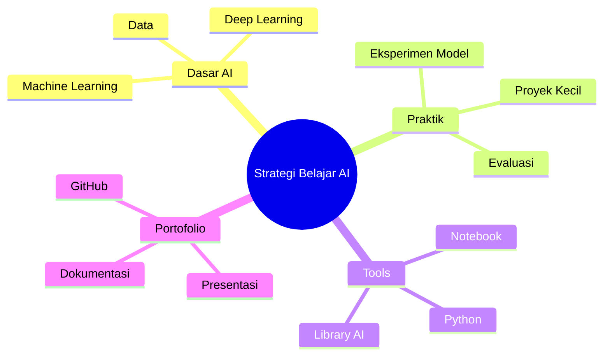

# Generator Runtime Evidence

Evidence date: 2026-07-22 Asia/Jakarta

## Fix Smoke Test

The fixed runtime was smoke-tested without relying on perfect model output by invoking deterministic repair/compile fallback directly.

## Mind Map Prompt

Prompt:

`Buat mind map tentang strategi belajar AI untuk mahasiswa.`

Final valid code:



Validation: valid Mind Map Mermaid code.

## Venn Prompt

Prompt:

`Buat diagram Venn tentang Instagram, TikTok, dan WhatsApp marketing.`

Final valid code:

```mermaid
venn
  set A["Instagram"]
  set B["TikTok"]
  set C["WhatsApp"]
  union A,B
    text "Audience Engagement"
  union A,C
    text "Customer Communication"
  union B,C
    text "Short Content Sharing"
  union A,B,C
    text "Digital Marketing"
```

Validation: valid Venn Mermaid code.

Renderer alignment: the preview converts the first line from `venn` to `venn-beta` internally.

## Screenshot Evidence

- `docs/evidence/screenshots/fix/01_mindmap_render_success.png`
- `docs/evidence/screenshots/fix/02_venn_render_success.png`
- `docs/evidence/screenshots/fix/03_validation_success.png`

These screenshots are from a local HTML preview page using the same project Mermaid preview renderer.

## Interpretation

The fix does not claim that the LoRA model is perfect. It guarantees that invalid model output is extracted, repaired, or replaced by deterministic valid Mermaid before rendering.
